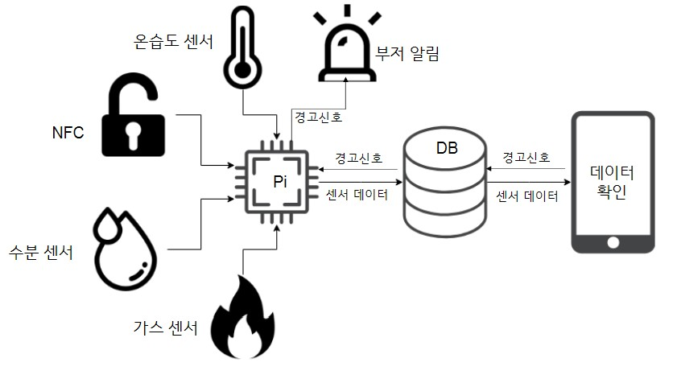
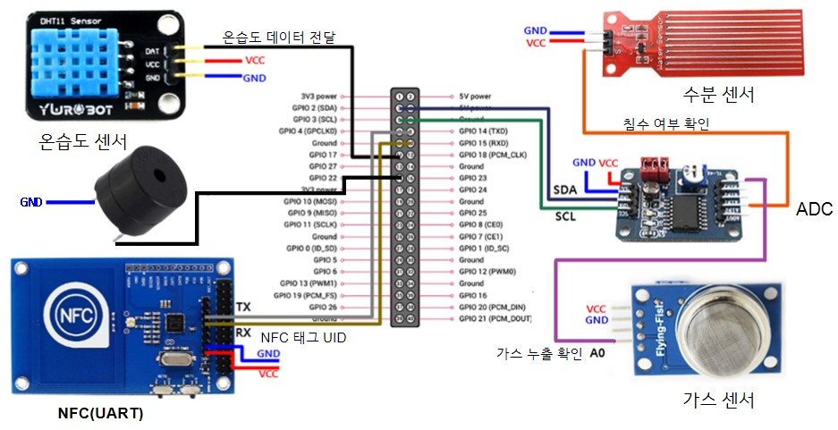
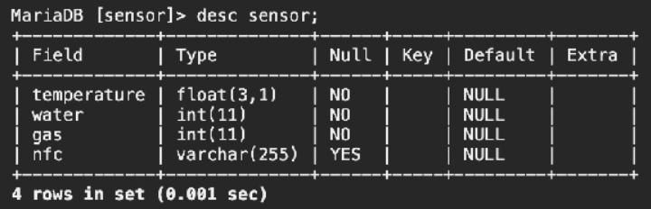
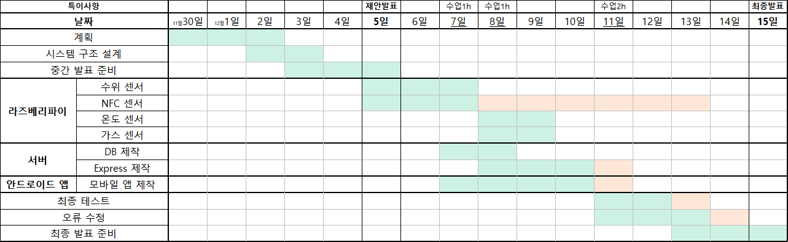

<br/>

### Contributors

|프로필|학번|역할|
|:---:|:---:|:---|
|<a href="https://github.com/Dyoya/"><br /><sub><b>Dyoya (김형민)</b></sub></a><br /> <a href="https://github.com/Dyoya/EmbeddedProject/commits?author=Dyoya" title="Commit Log">💻</a>|20190348|- 역할<br>- 역할|
|<a href="https://github.com/ParkSGye/"><br /><sub><b>ParkSGye (박성규)</b></sub></a><br /> <a href="https://github.com/Dyoya/EmbeddedProject/commits?author=ParkSGye" title="Commit Log">💻</a>|20190452|- 역할<br>- 역할|
|<a href="https://github.com/user71309876/"><br /><sub><b>user71309876 (박재현)</b></sub></a><br /> <a href="https://github.com/Dyoya/EmbeddedProject/commits?author=user71309876" title="Commit Log">💻</a>|20180474|- 역할<br>- 역할|
|<a href="https://github.com/dwgns/"><br /><sub><b>dwgns (안지훈)</b></sub></a><br /> <a href="https://github.com/Dyoya/EmbeddedProject/commits?author=dwgns" title="Commit Log">💻</a>|20190685|- 역할<br>- 역할|

# List
1. [아이디어 소개](https://github.com/Dyoya/EmbeddedProject#아이디어-소개)
2. [전체 시스템 구조](https://github.com/Dyoya/EmbeddedProject#전체-시스템-구조)
3. [회로 구조도](https://github.com/Dyoya/EmbeddedProject#회로-구조도)
5. [제한 조건](https://github.com/Dyoya/EmbeddedProject#제한-조건)
6. [가산점 요소](https://github.com/Dyoya/EmbeddedProject#가산점-요소)
7. [구현 내용](https://github.com/Dyoya/EmbeddedProject#구현-내용)
8. [실행 방법](https://github.com/Dyoya/EmbeddedProject#실행-방법)
9. [사용법](https://github.com/Dyoya/EmbeddedProject#사용법)
10. [개발 일정](https://github.com/Dyoya/EmbeddedProject#개발-일정)
11. [참고문헌](https://github.com/Dyoya/EmbeddedProject#참고문헌)

# 아이디어 소개
 **간이 자동차 프로젝트**는 차량의 여러 상황변화(ex.온도, 차량내부 수위, 가스 농도, NFC read)를 감지하여 확보한 데이터를 사용자의 스마트폰 어플에 송신하는 프로그램이다. 데이터에서 과도한 변화가 생길 경우 프로그램은 사용자의 스마트폰에 알람을 발생시키며, NFC 리더기에 타 사용자의 카드키(혹은 리더기에 처음 등록하는 카드키)에 대해 차량 내부 부저로 경고를 울리며 사용자의 스마트폰에 경고 신호를 보낸다.

# 전체 시스템 구조
 **온습도 센서**에서 온도, **수위 센서**, **가스 센서**, **NFC 리더기**가 데이터를 읽어 라즈베리 파이가 받는다. 라즈베리 파이는 해당 데이터를 하나의 **JSON 형식**으로 종합하여 서버로 전송한다. 서버의 **DB**에 값이 저장되며, 스마트폰의 **안드로이드 앱**은 서버에서 데이터를 읽어 사용자에게 보여준다. NFC가 처음 인식된 경우는 사용자가 스마트폰을 통해 **경고 신호**를 서버로 보낼 수 있다. 라즈베리 파이는 서버로부터 경고 신호를 받아 부저를 울려 경고할 수 있다.
 


# 회로 구조도
 **온습도 센서**는 읽은 데이터를 디지털 신호로 전송할 수 있다. 그래서, 라즈베리 파이의 GPIO 핀에 직접 연결했다. **수위 센서**는 아날로그 신호를 전송하기 때문에 ADC 컨버터를 사용해 라즈베리 파이에 연결했다. **가스 센서**는 디지털 신호를 전송할 수 있지만, 디지털 신호는 0과 1로 가스 감지 여부만이 있기 때문에 아날로그 신호를 ADC 컨버터를 이용해 라즈베리 파이와 연결했다. **NFC 리더기**는 UART 통신을 사용하므로 라즈베리 파이의 TX, RX핀과 연결했다.
 


# 제한 조건
## Thread
 내용내용

## Mutex
 내용내용

# 가산점 요소
> 서버를 통한 라즈베리 파이와 스마트폰 통신
> 
> 다른 수업의 내용과 병합한 서버 개발 및 안드로이드 앱 개발

# 구현 내용
## 1. RasberryPi
 헤더 파일 **common.h**를 만들어 여러 코드를 하나로 합쳤다. common.h는 공유 변수 및 함수가 선언되어 있고, common.c에는 정의되어 있다. 
 
- **temperature.c**  
 온습도 센서를 사용하는 temperatureSensorFun(void*) 함수가 있는 코드다. 

## 2. Server
 데이터베이스의 4가지 센서값을 받아들일 수 있게 temperature, water, gas, nfc의 속성으로 구성했다.



아래는 센서값을 DB에 저장하는 코드다. 라즈베리파이는 CURL을 이용하여 호스트 주소에 접근하여 센서값을 POST 방식으로 서버에 전달한다. 그리고 서버는 받은 값을 이용하여 DB를 갱신한다. 센서값은 가장 최신의 값만 유효하다는 특징이 있어 튜플을 누적시키지 않고 1열의 튜플값을 갱신시키도록 했다.

```javascript
app.post("/sensor", (req, res) => {
  const sql = "update sensor set temperature=?, water=?, gas=?, nfc=?";
  var params = [
    req.body.temperature,
    req.body.water,
    req.body.gas,
    req.body.nfc,
  ];
  console.log(params);
  db.query(sql, params, (err, rows, fields) => {
    console.log(rows);
    if (err) {
      res.json({ result: "error" });
      return console.log(err);
    }
    res.json(rows);
  });
});
```

아래는 앱에서 센서의 값을 받아오는 코드다. 앱은 Retrofit을 사용하여 GET 방식으로 값을 받아온다.

```javascript
app.get("/sensor", (req, res) => {
  const sql = "select * from sensor";
  db.query(sql, (err, rows) => {
    if (err) {
      res.json({ result: "error" });
      return console.log(err);
    }
    res.json(rows);
  });
});
```

아래는 라즈베리파이에서 알람 flag값을 받아오는 코드다. 알람 flag값이 true이면 알람을 울리라는 json 형식의 데이터를 보낸다.

```javascript
app.get("/buzzer", (req, res) => {
  if (result) {
    res.json({ warning: "noise" });
    result = false;
  } else {
    res.json({ warning: "quiet" });
  }
  console.log(result);
});
```

아래는 앱에서 유효하지 않은 NFC가 접근했을 때 알람 flag값을 변경하는 코드다. 알람 flag값이 true이면 부저를 울리고 false이면 부저를 울리지 않는다.

```javascript
app.get("/warning", (req, res) => {
  if (result == false) {
    result = true;
    res.json({ warning: "Get Ok" });
    console.log(result);
  }
});
```


## 3. Android App
 내용내용
 
## 4. Makefile
 내용내용

# 실행 방법
 ### 라즈베리파이 환경
  1. wiringPi 설치
  ```
  git clone https://github.com/WiringPi/WiringPi.git
  cd WiringPi
  git pull origin
  ./bulid
  ```
  설치가 성공적인지 확인합니다
  ```
  gpio -v
  ```

   2. curl 설치
  ```
  sudo apt update
  sudo apt install -y curl
  ```
  설치가 끝났다면 버전을 확인합니다.
  ```
  curl --version
  ```

  3. 실행 파일 빌드
  ```
  cd RaspberryPi && make
  ```
  파일 실행
  ```
  ./myprogram
  ```
### 서버 환경
  1. node.js 설치
     [Node.js 홈페이지](https://nodejs.org/en/download) 
  2. 서버 실행
  ```
  cd Server node && server.js
  ```


# 사용법
이 프로젝트는 다음 4가지 주요 센서를 사용하여 측정된 값을 사용한다.

### 1. NFC 리더
  NFC 카드를 리더기에 태그한다. 태그 시 스마트폰 어플리케이션에서 알람이 발생하며 등록이나 취소를 선택할 수 있다. 또한 태그 성공 시 부저를 통한 청각적 피드백이 발생한다.
### 2. 온도 센서
  주기적으로 온도를 측정한다. 측정된 값은 스마트폰 어플리케이션의 온도 센서 항목을 통해 확인할 수 있다.
### 3. 수위 센서
  주기적으로 수위를 측정한다. 마찬가지로 스마트폰 어플리케이션의 수위 센서 항목을 통해 확인할 수 있다.
### 4. 가스 센서
  주기적으로 가스 농도를 측정한다. 위와 동일.

측정된 정보는 데이터베이스에 저장되며 저장된 정보는 스마트폰 어플리케이션을 통해 확인할 수 있다. 따라서 프로그램이 작동하기 위해서는 데이터베이스 서버 구동 및 스마트폰 어플리케이션 설치를 요구한다.
NFC를 제외한 나머지 센서들의 경우 특이사항(비정상적으로 높은 온도 등) 발생 시 스마트폰 어플리케이션 화면에서 각 항목에 대해 빨간색으로 강조 처리되고 백그라운드 경고 알림을 발생시킨다.


# 개발 일정
 아래 사진은 11월 30일부터 12월 15일까지의 개발 일정이다. 초록색 영역은 기존에 계획했던 부분이고 대부분 맞춰서 개발되었다. 주황색 영역은 기간 안에 완성하지 못하여 추가로 소요된 기간을 표시한 것이다.




# 참고문헌
[가스 센서(MQ-5)](https://m.blog.naver.com/elepartsblog/221528526035)

[MCP3208 ADC 컨버터 사용하기](https://diymaker.tistory.com/155)

[MCP3008 + 수위센서](https://blog.naver.com/PostView.naver?blogId=roboholic84&logNo=220416082742)

[NFC Reader(PN532)](https://m.blog.naver.com/tiled12/221794166065)

[온습도 센서](https://blog.naver.com/PostView.naver?blogId=dokkosam&logNo=222162911335)

[CURL 명령어 사용법 정리](https://inpa.tistory.com/entry/LINUX-%F0%9F%93%9A-CURL-%EB%AA%85%EB%A0%B9%EC%96%B4-%EC%82%AC%EC%9A%A9%EB%B2%95-%EB%8B%A4%EC%96%91%ED%95%9C-%EC%98%88%EC%A0%9C%EB%A1%9C-%EC%A0%95%EB%A6%AC)
